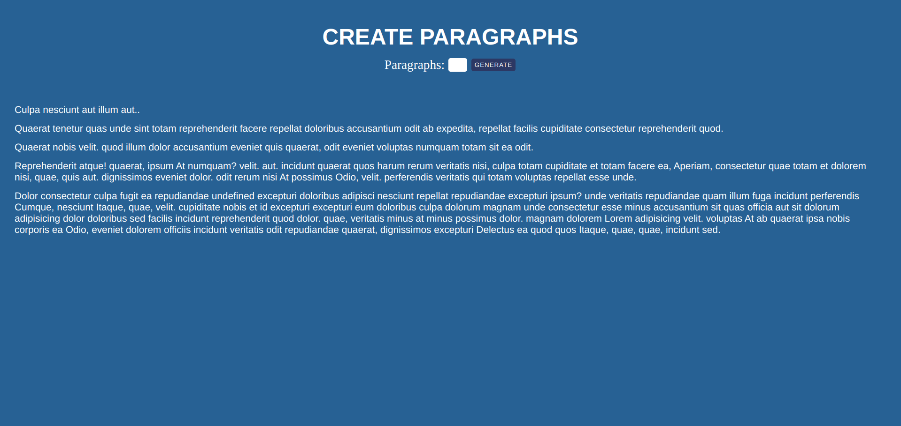

# LOREM PROJECT

## FRONTEND PRACTICE PROJECT NO: 13

1. I used Javascript, Jquery, HTML, CSS to practice my skills.

2. When you enter a number between 1 to 100 and click button or press enter, it will create a new paragraph with equal length of words of your input.
